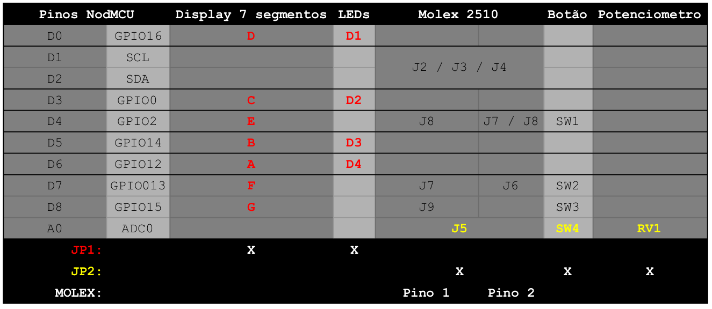
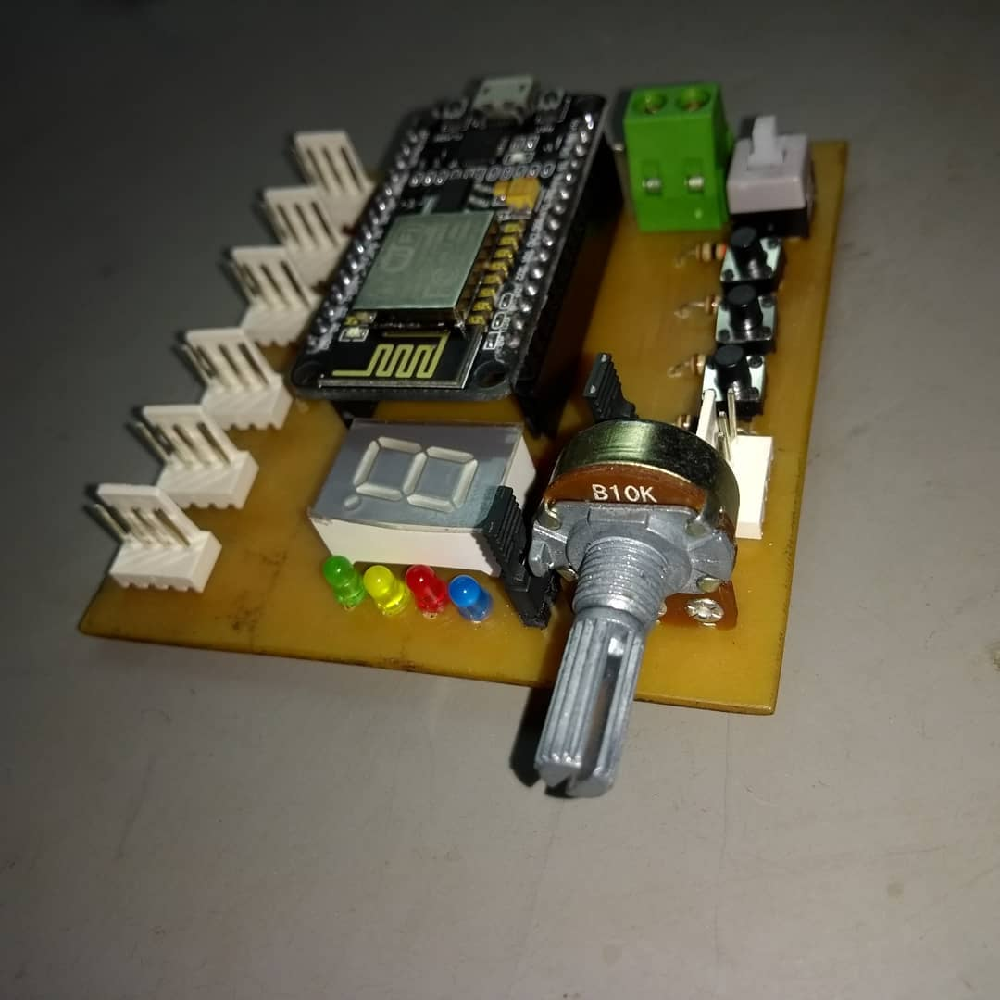

# ShieldIoT-IFSP

Licença: GNU GPL 2

This program is free software; you can redistribute it and/or
modify it under the terms of the GNU General Public License as
published by the Free Software Foundation; version 2 of the
License.

This program is distributed in the hope that it will be useful,
but WITHOUT ANY WARRANTY; without even the implied warranty of
MERCHANTABILITY or FITNESS FOR A PARTICULAR PURPOSE.  See the
GNU General Public License for more details.

---

O SHIELD IoT-IFSP é uma placa didática criada para a plataforma NodeMCU (ESP8266) de baixo custo, desenvolvida para o ensino de lógica de programação aplicada à robótica e Iot (internet das coisas), cujo principal objetivo é facilitar o ensino de lógica de programação.

Neste Repositório se encontra todos os arquivos necessários para o **DESENVOLVIMENTO e DOCUMENTAÇÃO** para a **Shield IoT**, não Existe exemplos e programas testes para essa versão embora versões anteriores já tenham sido testadas (e falharam em algum ponto) no entanto esta versão está aparentemente está tudo certo, ela leva correções eletrônicas e de layout.

Na pasta [PCB](PCB/) estão os arquivos para fabricação da placa, tanto o [GERBER](PCB/GERBER/) para fabricação manufaturada, e um [PDF]() para fabricação manual por transferência térmica. Em [Documentação](Documentação/) temos os arquivos referente ao circuito, lá encontrado o BOM (lista de componentes, e em formato ods feito pelo libreoffice), O [esquema elétrico](Documentação/esquematico.pdf) em pdf e o [arquivos do kicad](Documentação/Circuito/) e suas dependências.

# Uso dos pinos atual:

# O que precisa ser feio
* Testar placa, e todos os periféricos disponíveis para uso;
* Fazer um manual como a [Shield Edu-IFSP ](https://github.com/gerse-ifsp-campus-guarulhos/ShieldEdu-IFSP);
* programa testes como o [Exemplo da Shield Edu-IFSP](https://github.com/gerse-ifsp-campus-guarulhos/ShieldEdu-IFSP/tree/master/Exemplos);
* Criar artigos e publicações.

# Versão antiga

